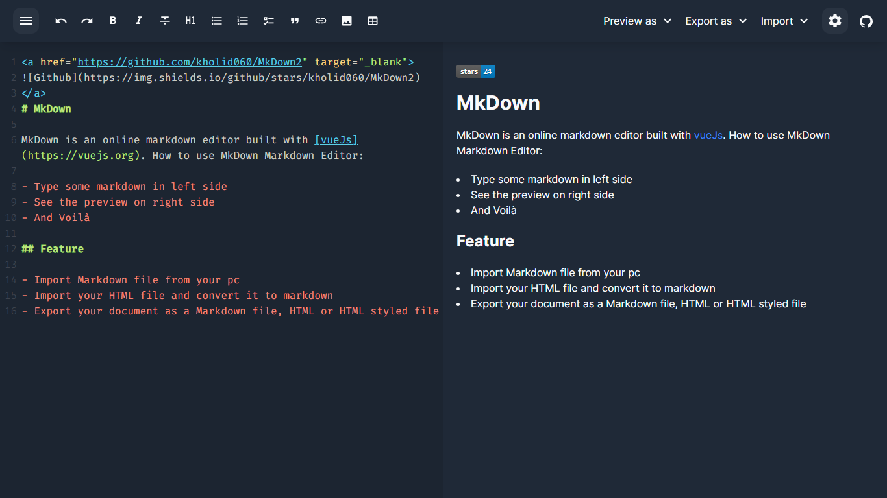

# MkDown

MkDown is an online markdown editor built with [vueJs](https://vuejs.org)

> Demo [here](https://mkdown.vercel.app)


## Feature

- Import Markdown file from your pc
- Import your HTML file and convert it to markdown
- Export your document as a Markdown file, HTML or HTML styled file

And I think that's it

## Project setup

### Docker

#### Help
```
make
```

#### Compiles and hot-reloads for development
```
make dev
```
go to http://localhost:3000

#### Compiles and minifies for production
```
make build
```

#### Run production server
```
make production
```
go to http://localhost:4127

### Node
```
yarn
```

#### Compiles and hot-reloads for development
```
yarn dev
```

#### Compiles and minifies for production
```
yarn build
```

#### Lints and fixes files
```
yarn lint
```

### Customize configuration
See [Configuration Reference](https://cli.vuejs.org/config/).
